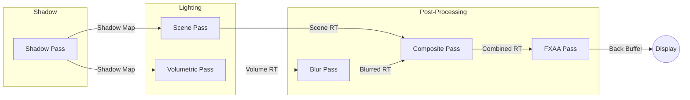

# Spotlight Renderer

A technical demonstration of a physically-based volumetric lighting engine utilizing DirectX 11 and HLSL. This project showcases real-time ray-marching, shadow mapping, and hierarchical fixture loading via the General Device Type Format (GDTF) standard, built from scratch without commercial game engines.

[](https://www.youtube.com/watch?v=ap32ZcuJYaw)
*▶ Click to watch — Real-time volumetric lighting with Mie scattering and shadow mapping.*

## Core Features

### 🔦 Volumetric Rendering
- **Real-Time Ray Marching:** GPU-based ray marching loop with dithering to simulate light interaction with atmospheric media.
- **Physical Scattering:** Implements the Henyey-Greenstein phase function for realistic Mie scattering (haze/fog).
- **Volumetric Shadows:** High-resolution shadow maps cast through the volumetric buffer, creating "god rays" and occlusion.
- **Post-Processing:** Kawase blur and FXAA for noise reduction and edge smoothing.

### 🏗️ GDTF & Scene Graph
- **GDTF Support:** Native parsing of `.gdtf` archives (ZIP), extracting `description.xml` and 3D assets. [GDTF](https://gdtf-share.com/) is an open standard for describing lighting fixtures.
- **Hierarchical Loading:** Reconstructs complex fixture geometry (Base → Yoke → Head) into a transformable scene graph.
- **Model Support:** Uses **Assimp** to load diverse mesh data (GLB, glTF, 3DS) embedded within fixtures.

### ⚙️ Engine Technology
- **Pure DirectX 11:** Custom C++17 renderer with no third-party engine dependencies.
- **Render Pipeline:** Multi-pass architecture:


- **Interactive UI:** Powered by ImGui for real-time manipulation of light parameters (Beam Angle, Zoom, Color Mixing, Gobo Shake).

## Requirements

- **OS:** Windows 10/11
- **IDE:** Visual Studio 2022+ (C++ Desktop Development workload)
- **Build System:** CMake 3.15+
- **GPU:** DirectX 11 compatible hardware
- **Tools:** Git (for vcpkg), Ninja (included with Visual Studio)

## Build Instructions

1.  **Clone the repository:**
    ```powershell
    git clone https://github.com/your-repo/spotlight-renderer.git
    cd spotlight-renderer
    ```

2.  **Setup vcpkg** (first time only):
    ```powershell
    git clone https://github.com/Microsoft/vcpkg.git
    .\vcpkg\bootstrap-vcpkg.bat
    ```

3.  **Build** (uses Ninja, generates `compile_commands.json` for linting):
    ```powershell
    .\build.bat              # Debug build
    .\build.bat --release    # Release build
    ```

4.  **Run:**
    ```powershell
    .\run.bat              # Run Debug build
    .\run.bat --release    # Run Release build
    .\run.bat --build      # Build and run
    ```

5.  **Lint** (requires build first):
    ```powershell
    pwsh -File .\scripts\lint.ps1
    ```

## Controls

The application launches with an ImGui overlay window "Spotlight Renderer Controls".

### Camera
- **Distance / Pitch / Yaw:** Orbit around the scene.
- **Target:** Set the look-at point.

### Demo Effects
- **Enable Demo:** Toggle automated light animation.
- **Speed:** Animation playback rate.
- **Pan / Tilt / Rainbow / Gobo Rotation:** Toggle individual effects.

### Spotlight Parameters
- **Pan / Tilt:** GDTF fixture orientation.
- **Color / Intensity / Range:** Light appearance and reach.
- **Beam Angle / Field Angle:** Cone shape and softness.
- **Gobo:** Select pattern, rotation, and shake amount.

### Volumetric Quality
- **Step Count:** Ray-marching samples (quality vs. performance).
- **Density:** Atmospheric thickness.
- **Intensity Multiplier:** Volumetric brightness.
- **Anisotropy (g):** Forward vs. backward scattering.

### Post Processing
- **FXAA:** Anti-aliasing toggle.
- **Volumetric Blur:** Soften volumetric output.
- **Blur Passes:** Number of blur iterations.

## Technical Details

- **Language:** C++17
- **Graphics API:** DirectX 11
- **Shader Model:** 5.0 (HLSL)
- **External Libraries:**
    - `ImGui`: User Interface
    - `tinyobjloader`: OBJ Mesh Loading (Static geometry)
    - `assimp`: GLB, glTF, 3DS Mesh Loading (Fixture geometry)
    - `stb_image`: Texture Loading
    - `pugixml`: XML Parsing (GDTF)
    - `miniz`: Archive extraction (GDTF)

## References

- Henyey, L.G. & Greenstein, J.L. (1941). *Diffuse radiation in the galaxy* — Phase function for Mie scattering
- Williams, L. (1978). *Casting curved shadows on curved surfaces* — Shadow mapping
- Blinn, J. (1977). *Models of light reflection for computer synthesized pictures* — Blinn-Phong shading
- Lottes, T. (2009). *FXAA 3.11*, NVIDIA — Fast approximate anti-aliasing
- Jimenez, J. (2014). *Interleaved Gradient Noise* — Temporal-stable dithering for ray marching
